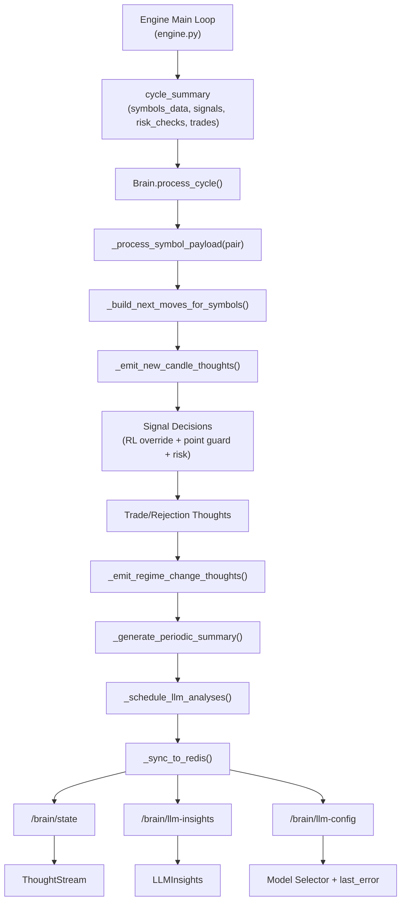
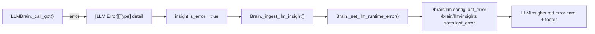

# Brain Flow Map

This is the execution map for the Brain subsystem.
Use it as the single source of truth for data flow and debugging paths.

## 1) Runtime Flow (Engine -> Brain -> API -> UI)

## 2) LLM Error Propagation Map

## 3) Pair Processing Map

For each symbol/pair in `symbols_data`:
- `Brain._process_symbol_payload(pair, payload)`
  - updates market snapshot
  - updates strategy scores for that pair
  - detects regime change for that pair
  - checks RSI/ADX crossings for that pair
- pair snapshot is then used by:
  - `ThoughtStream` thought metadata (`symbol`, `price`, `price_change`)
  - `NextMoves` generation per pair
  - periodic pair digest
  - LLM market payload (`symbol_data`)

## 4) API Response Ownership

| Endpoint | Source of Truth |
|---|---|
| `/brain/state` | local Brain if engine process, otherwise Redis state |
| `/brain/llm-insights` | local LLM history if engine process, otherwise Redis state |
| `/brain/llm-config` | runtime provider/model + `last_error` from Brain |

## 5) Quick Triage Checklist

1. If a pair has no thoughts: confirm pair exists in `symbols_data` and `new_candle` toggles.
2. If LLM card is red: inspect `/brain/llm-config.last_error` and provider env vars.
3. If API has stale data: validate Redis health and key freshness (`jsr:brain:state`).
4. If strategy behavior seems off for one pair: inspect pair-specific score/reason and point-guard status.
5. If startup/import fails around brain state files: verify writable brain data dir (`BRAIN_DATA_DIR` or `/tmp/jsr-hydra/brain` fallback).
